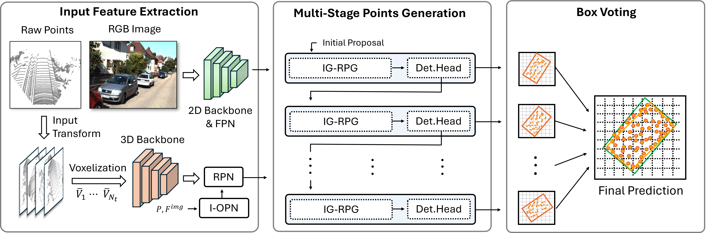
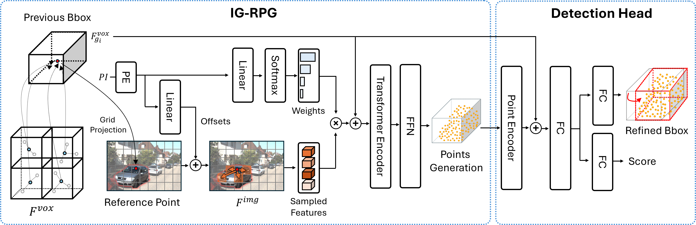
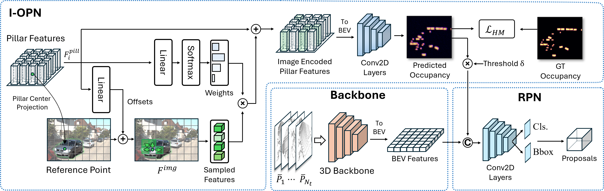

<div align="center">

# Image-Guided Semantic Pseudo-LiDAR Point Generation for 3D Object Detection

**Minseung Lee¹**, **Seokha Moon¹**, **Seung Joon Lee²**, **Reza Mahjourian³**, and **Jinkyu Kim¹**  
¹CSE, Korea University · ²LG Innotek · ³Waymo Research  

<a href="https://arxiv.org/abs/2409.14985"></a>

</div>

## Overview





## Model Zoo

| **Method** | **Training Time** | **Car@R40** | **Pedestrian@R40** | **Cyclist@R40** | **Download** |
|------------|------------------|------------|--------------------|----------------|-------------|
| [ImagePG](tools/cfgs/kitti_models/imagepg.yaml) | ~12 hours | 85.67 | 71.01 | 78.94 | [ckpt](https://drive.google.com/file/d/1KZMLWpEUr-Gat_cJBkchLVxV9cLdE7HR/view?usp=sharing) |

Note that ImagePG is trained with 8 NVIDIA A6000 GPUs.


## Installation

Clone and create conda environment.
```bash
git clone https://github.com/MS-LIMA/ImagePG.git
cd ImagePG

conda create -n imagepg python=3.8 -y
conda activate imagepg
```

Download pretrained 2D backbone weight.
```bash
mkdir -p ckpt
cd ckpt

wget https://github.com/SwinTransformer/storage/releases/download/v1.0.0/swin_tiny_patch4_window7_224.pth
cd ..
```

Install requirements.
```bash
pip install torch==1.10.0+cu111 torchvision==0.11.0+cu111 torchaudio==0.10.0 -f https://download.pytorch.org/whl/torch_stable.html
pip install -r requirements.txt
pip install "git+https://github.com/facebookresearch/pytorch3d.git@v0.7.7"
pip install spconv-cu113
```

Compile libraries.
```bash
pip install -v -e . 
cd pcdet/ops/deform_attn/ops
python setup.py build develop
cd ../../../..
```

## Dataset Setup

```bash
data/
└── kitti/
    ├── training/
    │   ├── calib/         
    │   ├── image_2/       
    │   ├── label_2/       
    │   ├── velodyne/      
    │   └── planes/
    ├── testing/
    │   ├── calib/         
    │   ├── image_2/      
    │   ├── velodyne/
    └── train_mirror_target/
        ├── bm_5maxdist_2num_Cyclist/
        ├── bm_5maxdist_2num_Pedestrian/
        └── bm_50maxdist_2num_Car/
```
Follow the guide from [OpenPCDet](https://github.com/open-mmlab/OpenPCDet/blob/master/docs/GETTING_STARTED.md) to prepare dataset. In addition, please refer to [BtcDet](https://github.com/Xharlie/BtcDet) to download dense point cloud (train_mirror_target) for KITTI dataset.


## Training & Evaluation

```bash
cd tools
```

### Train on KITTI
```bash
# 4 GPUs
bash scripts/dist_train.sh 4 \
--cfg_file cfgs/kitti_models/imagepg.yaml
```

### Evaluate
```bash
# 4 GPUs
bash scripts/dist_test.sh 4 \
--cfg_file cfgs/kitti_models/imagepg.yaml \
--ckpt ../ckpt/imagepg_kitti.pth \
--extra_tag val \
--batch_size 4  
```

## Acknowledgements
We thank for the multiple great open-sourced code bases.
- [OpenPCDet](https://github.com/open-mmlab/OpenPCDet/tree/master) 
- [BtcDet](https://github.com/Xharlie/BtcDet)
- [LoGoNet](https://github.com/PJLab-ADG/LoGoNet)
- [TED](https://github.com/hailanyi/TED)
- [BSH-Det3D](https://github.com/mystorm16/BSH-Det3D)
- [PG-RCNN](https://github.com/quotation2520/PG-RCNN)

## Citation
```bibtex
@article{lee2025imagepg,
      title={Image-Guided Semantic Pseudo-LiDAR Point Generation for 3D Object Detection}, 
      author={Minseung Lee and Seokha Moon and Seung Joon Lee and Reza Mahjourian and Jinkyu Kim},
      year={2025},
      eprint={2409.14985},
      archivePrefix={arXiv},
      primaryClass={cs.CV},
      url={https://arxiv.org/abs/2409.14985}, 
}
```
